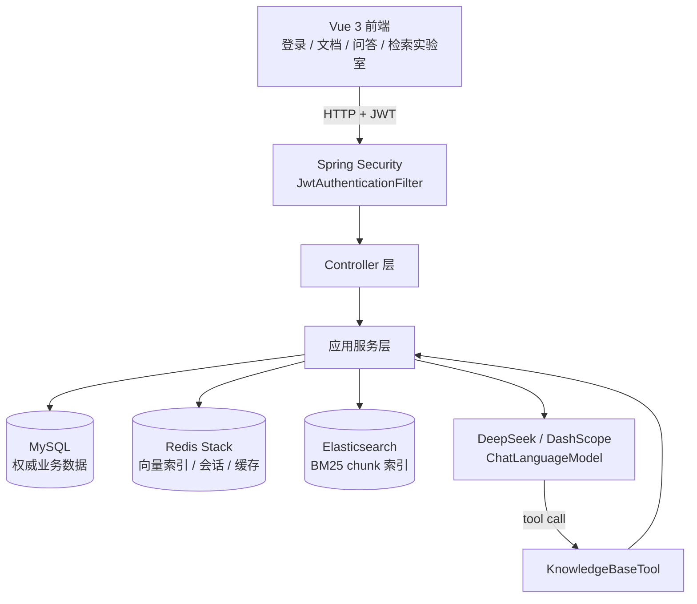
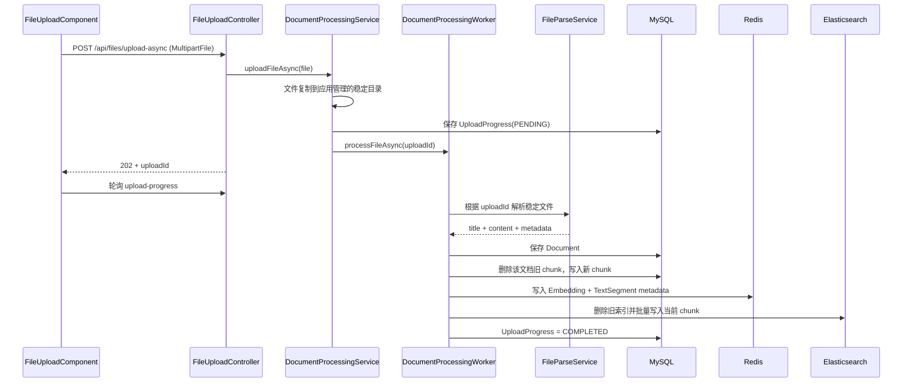
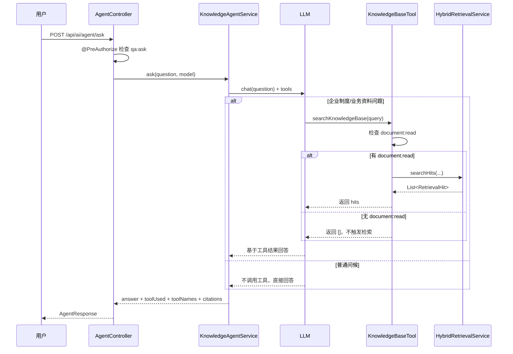

# 企业知识库 Agent：架构与核心调用链

这份文档描述当前已经实现并验证的架构，不包含 MCP、多 Agent、Reranker 或逐文档 ACL 等计划功能。

## 1. 一句话心智模型

```text
MySQL 保存权威文档
  -> Redis 和 Elasticsearch 建立两种可重建索引
  -> RRF 融合两份排名
  -> 只给 Top K 候选补全 MySQL 原文
  -> Agent 按需调用检索工具
  -> 大模型根据证据回答并返回引用
```

## 2. 总体架构



责任边界：

| 层/组件 | 负责 | 不负责 |
|---|---|---|
| Vue 前端 | 收集输入、展示文档/答案/引用 | 决定检索排名、保存权威数据 |
| Controller | HTTP 参数与响应边界 | 编排复杂检索流程 |
| Service | 业务步骤、事务和外部组件编排 | 直接承担页面展示 |
| MySQL | 文档和 chunk 的最终权威版本 | 相似度检索 |
| Redis | Embedding 向量召回 | 保存不可丢失的文档事实 |
| Elasticsearch | BM25 关键词召回 | 作为文档权威数据源 |
| LLM | 工具选择、基于证据组织回答 | 决定企业事实是否正确 |

## 3. 文档入库链路

输入：PDF、DOCX、TXT、Markdown 等文件。
输出：MySQL 文档与 chunk、Redis 向量索引、Elasticsearch BM25 索引。



为什么先删除旧 chunk 再重建：文档修改后，旧正文可能产生了不同数量、不同内容的切片；仅覆盖当前编号会留下已经不存在的旧切片。删除依据只需要 `documentId`，重新生成阶段才需要当前正文。

重要边界：三份文件同时异步处理时，实际发生过一次 MySQL `document_chunks` 写入死锁。失败文档的主记录已经保存，最终通过 `POST /api/documents/{id}/vectorize` 串行重建成功。当前链路可演示，但还没有生产级死锁重试和并发治理。

## 4. Redis 向量召回

入口：`VectorSearchService.searchVectorCandidates()`。

```text
用户 query
  -> EmbeddingModel 生成查询向量
  -> RedisEmbeddingStore.search()
  -> List<EmbeddingMatch<TextSegment>>
  -> 从 TextSegment.metadata 读取 documentId、chunkIndex
  -> 根据返回顺序生成 rank = 1, 2, 3...
  -> RetrievalCandidate(source = REDIS_VECTOR)
```

Redis 中不仅保存 384 维向量，还保存 `TextSegment` 原文和 `documentId + chunkIndex`。向量负责计算相似度，metadata 负责把搜索结果重新定位到业务文档分块。

候选阶段不查询 MySQL，因为 RRF 只需要 chunk 身份、排名和来源。

## 5. Elasticsearch BM25 召回

入口：`ElasticsearchSearchService.searchBm25Candidates()`。

索引最小字段：

```text
documentId: long
chunkIndex: integer
content: text
```

```text
用户 query
  -> match(content, query)
  -> Elasticsearch 使用 BM25 计算 _score
  -> 按 _score 降序返回 hit
  -> 根据返回顺序生成 rank
  -> RetrievalCandidate(source = ELASTICSEARCH_BM25)
```

BM25 不是“返回 25 条”，而是关键词相关性排序算法的名称。它擅长制度名、产品名、错误码、P1 等精确词匹配。

## 6. 为什么使用统一候选和 RRF

Redis 的余弦相似度与 Elasticsearch 的 BM25 `_score` 不在同一量纲，不能直接相加。

两路先统一成：

```text
RetrievalCandidate
  documentId
  chunkIndex
  rank
  rawScore
  source
```

`RrfFusionService.fuse()` 使用 `documentId + "_" + chunkIndex` 识别同一 chunk。每一路对候选的贡献为：

```text
1 / (60 + rank)
```

同一 chunk 被两路命中时，两个贡献相加并合并 `sources`。最终按 `fusionScore` 降序取 Top K。

RRF 的价值不是保证一定超过最强单路，而是避开异构分数归一化，让语义召回和关键词召回用各自的排名共同投票。

## 7. Top K 后为什么还要查询 MySQL

`RetrievalCandidate` 只够排序，不是最终回答证据。模型和前端还需要最新标题、chunk 主键和权威原文。

```text
List<FusedRetrievalCandidate>
  -> 收集 documentId 集合与 chunkIndex 集合
  -> DocumentChunkRepository 一次 JOIN FETCH 查询
  -> 用 documentId + chunkIndex 建 Map
  -> 按 RRF 原顺序精确匹配
  -> RetrievalHit
```

必须进行“精确匹配”，因为 SQL 使用的是两个集合：

```text
documentId IN (...)
AND chunkIndex IN (...)
```

它可能取出集合的交叉组合。Service 需要再次按复合键过滤，避免把不在 Top K 的 chunk 拼进结果。

实测 Top K 补全阶段只执行 1 条 SQL，避免逐条查询导致 N+1。

## 8. RAG 问答链路

固定 RAG 接口：

```text
POST /api/ai/ask
  -> AiService
  -> HybridRetrievalService.searchHits()
  -> RetrievalHit 转成带编号的上下文
  -> ChatLanguageModel
  -> answer + citations
```

SSE 接口会逐段推送 `message`，结束时通过 metadata 返回 citations。即使答案来自缓存，引用也会随 metadata 返回。

## 9. Agent 工具调用链路



当前 Agent 与固定 RAG 的区别：固定 RAG 每次都搜索；Agent 由模型根据问题决定是否调用 `searchKnowledgeBase`。当前没有手写多步 `while` Agent Loop，而是使用 LangChain4j `AiServices` 的工具调用能力。

## 10. 权限边界

当前只实现最小可演示的全局权限：

```text
进入 Agent 前：qa:ask
进入混合检索前：document:read
```

实测：

- GUEST 没有 `qa:ask`，HTTP 403，模型调用和检索都不会发生。
- QA-only 用户有 `qa:ask`、没有 `document:read`，可以进入 Agent，但工具在调用 Redis、Elasticsearch 和 MySQL 前直接返回空列表，citations 为空。

这不能宣称为逐文档 ACL。部门、租户、文档密级等过滤仍是后续生产化工作。

## 11. 评测结论

4 篇文档、8 个 chunk、15 个问题的固定评测：

| 策略 | Hit@3 | Recall@3 | 平均延迟 | P95 |
|---|---:|---:|---:|---:|
| Redis | 0.8000 | 0.7667 | 116.059 ms | 524.068 ms |
| Elasticsearch | 1.0000 | 1.0000 | 52.373 ms | 70.848 ms |
| RRF | 0.9333 | 0.9333 | 214.430 ms | 348.513 ms |

结论：

- 当前中文制度小样本中 BM25 最强。
- RRF 比向量单路更准，但没有超过 BM25。
- 当前两路串行执行，RRF 延迟高于单路。
- 面试时应讲真实取舍：混合检索提高召回稳健性，但需要并行化、阈值或 Reranker 才可能进一步改善精度与延迟。

## 12. 最小代码阅读顺序

1. `AgentController.ask()`：HTTP 入口和请求权限。
2. `KnowledgeAgentService.ask()`：创建 Agent，注册工具，提取工具执行结果。
3. `KnowledgeBaseTool.searchKnowledgeBase()`：知识库工具和结果权限。
4. `HybridRetrievalService.searchHits()`：双路召回与结果补全编排。
5. `VectorSearchService.searchVectorCandidates()`：Redis 候选。
6. `ElasticsearchSearchService.searchBm25Candidates()`：BM25 候选。
7. `RrfFusionService.fuse()`：去重、融合和 Top K。
8. `RetrievalResultService.assembleHits()`：一条 MySQL 查询补全最终证据。
