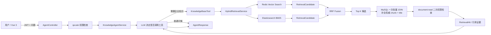

# Enterprise Knowledge Agent

基于 Java 21、Spring Boot、LangChain4j、Redis Stack、Elasticsearch 和 MySQL 的企业知识库 Agent 二次开发项目。

项目不是只把文档塞给大模型：它用 Redis 做语义召回、Elasticsearch 做 BM25 关键词召回，通过 RRF 融合排名，再从 MySQL 批量取得权威原文。Agent 根据问题决定是否调用知识库工具，并返回可追溯到文档分块的引用证据。

> 项目基于开源知识库系统二次开发。文档 CRUD、文件解析和基础问答来自上游；Elasticsearch BM25、统一候选模型、RRF 融合、MySQL 批量补全、引用证据、Agent 工具调用、权限演示和检索评测是本轮重点改造。详细边界见 [面试与 Demo 手册](docs/04-interview-guide.md)。

## 核心能力

- 支持 PDF、Word、TXT、Markdown 等企业文档解析、分块和异步入库。
- Redis Stack 根据 Embedding 召回语义相近的 chunk。
- Elasticsearch 使用 BM25 召回关键词匹配的 chunk。
- 两路结果统一为 `RetrievalCandidate`，使用 RRF 按排名融合并去重。
- RRF Top K 确定后，通过一条 MySQL JOIN 查询补全文档标题和最新原文，组装 `RetrievalHit`。
- RAG 普通问答与 SSE 流式问答都能返回引用证据。
- LangChain4j Agent 可自主决定是否调用 `searchKnowledgeBase`。
- 使用 JWT、`qa:ask` 和 `document:read` 完成最小权限演示。
- 提供固定评测集，对比 Redis、Elasticsearch 和 RRF 的 Hit@3、Recall@3 与延迟。
- Vue 3 前端包含智能问答、知识库、检索实验室和评测看板。

## 架构



数据职责：

- **MySQL**：用户、文档、文档分块等权威业务数据。
- **Redis Stack**：可重建的向量索引、会话记忆和短期缓存。
- **Elasticsearch**：可重建的 BM25 关键词索引。
- **LLM**：基于检索证据生成回答，不作为企业事实的数据源。

更完整的入库链路、问答链路和责任边界见 [项目架构与调用链](docs/02-architecture-and-call-chain.md)。

## 检索评测

固定 4 篇文档、8 个 chunk、15 个标注问题的本地实测：

| 策略 | Hit@3 | Recall@3 | 平均延迟 | P95 延迟 |
|---|---:|---:|---:|---:|
| Redis 向量检索 | 0.8000 | 0.7667 | 116.059 ms | 524.068 ms |
| Elasticsearch BM25 | 1.0000 | 1.0000 | 52.373 ms | 70.848 ms |
| RRF 混合检索 | 0.9333 | 0.9333 | 214.430 ms | 348.513 ms |

这组小规模中文制度语料中 BM25 最好；RRF 相比单独向量检索提高了命中与召回，但没有超过 BM25，且当前两路串行执行导致延迟更高。项目不使用“混合检索一定更强”的虚假结论。完整口径见 [六天核心开发计划与验收](docs/03-six-day-core-plan.md)。

## 五分钟 Demo

演示语料位于 [`demo-data/knowledge-base`](demo-data/knowledge-base)，包含 DOCX、PDF、TXT 三种格式。

推荐演示顺序：

1. 使用 `admin / admin123` 登录，展示无 JWT 无法访问业务接口。
2. 在知识库页面查看三种格式的“星桥科技”演示文档。
3. 提问“公司每周哪两天允许申请远程办公，最晚什么时候提交？”。
4. 展示答案、具体 chunk 引用，以及 `REDIS_VECTOR + ELASTICSEARCH_BM25` 双路来源。
5. 提问“公司的股票期权分几年归属？”，展示知识缺失时拒绝编造。
6. 打开检索评测结果，解释为什么当前语料上 BM25 优于向量检索。

上传、解析和问答的实际验证证据见 [面试与 Demo 手册](docs/04-interview-guide.md)。

## 本地启动

要求：JDK 21、Docker Desktop、Node.js 22+。Hibernate 增强插件与当前依赖组合不支持使用 JDK 25 构建。

```powershell
# 1. 启动 MySQL、Redis Stack、Elasticsearch
docker compose -f docker/docker-compose.yml up -d mysql redis elasticsearch

# 2. 配置模型密钥
Copy-Item .env.template .env
# 至少填写默认模型所需的 DEEPSEEK_API_KEY

# 3. 后端
.\mvnw.cmd test
.\mvnw.cmd spring-boot:run

# 4. 前端（新终端）
Set-Location ai-assistant-front
npm.cmd ci
npm.cmd run dev -- --host 127.0.0.1
```

访问：

- 前端：`http://localhost:5173`
- 后端：`http://localhost:8080`
- Elasticsearch：`http://localhost:9200`
- RedisInsight：`http://localhost:8888`

## 关键代码

| 责任 | 入口 |
|---|---|
| Agent HTTP 接口 | `AgentController.ask()` |
| Agent 创建与工具结果提取 | `KnowledgeAgentService.ask()` |
| 知识库工具与读取权限 | `KnowledgeBaseTool.searchKnowledgeBase()` |
| 双路检索编排 | `HybridRetrievalService.searchHits()` |
| RRF 去重和融合 | `RrfFusionService.fuse()` |
| MySQL 批量补全 | `RetrievalResultService.assembleHits()` |
| 文档解析 | `FileParseService.parseFile()` |
| 异步入库 Worker | `DocumentProcessingWorker.processFileAsync()` |

## 已知边界

- 当前是全局业务权限演示，不是部门、租户、密级或逐文档 ACL。
- Redis 和 Elasticsearch 当前串行检索，混合链路延迟高于单路。
- 批量并发上传曾实测触发一次 MySQL 死锁；单文档串行补建成功，尚未实现生产级死锁重试。
- 复合问题可能让 Agent 重复调用知识库工具，导致引用重复。
- 固定 `TopK=5` 会夹带少量弱相关引用，尚未加入 Reranker。
- 不包含 MCP、多 Agent 或完整生产级可观测性，不将计划功能写成已实现成果。

## 面试与项目材料

- [项目介绍](docs/00-start-here.md)
- [原项目检查与二开边界](docs/01-upstream-audit.md)
- [架构与调用链](docs/02-architecture-and-call-chain.md)
- [六天核心开发计划与验收](docs/03-six-day-core-plan.md)
- [项目介绍、简历描述、Demo 与面试追问](docs/04-interview-guide.md)

## 来源与使用边界

本项目基于 [2518350LJL/ai-knowledge-base](https://github.com/2518350LJL/ai-knowledge-base) 的提交 `82fa41079387b3450787d709b6a6efd17b45c00e` 进行学习型二次开发。上游来源与分发边界见 [UPSTREAM_NOTICE.md](UPSTREAM_NOTICE.md)。
