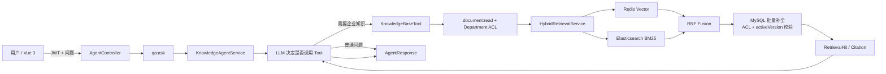

# Enterprise Knowledge Agent

基于 Java 21、Spring Boot、LangChain4j、Redis Stack、Elasticsearch 和 MySQL 的企业知识库 Agent 二次开发项目。

项目不是只把文档塞给大模型：它使用 Redis 做语义召回、Elasticsearch 做 BM25 关键词召回，通过 RRF 融合排名，再从 MySQL 批量取得权威原文。Agent 根据问题决定是否调用知识库工具，并返回可追溯到文档分块的引用证据。

> 项目基于开源知识库系统二次开发。文档 CRUD、文件解析和基础问答来自上游；BGE Embedding、Elasticsearch BM25、统一候选模型、RRF 融合、MySQL 批量补全、部门权限、引用证据、检索评测和文档版本化更新是本轮重点改造。

## 核心能力

- 支持 PDF、Word、TXT、Markdown 等企业文档解析、分块和异步入库。
- 使用 BGE-small-zh-v1.5 生成 Embedding，Redis Stack 负责语义召回。
- Elasticsearch 使用 BM25 召回关键词匹配的 chunk。
- 两路结果统一为 `RetrievalCandidate`，使用 RRF 按排名融合并去重。
- RRF Top K 确定后，通过 MySQL JOIN 批量补全权威 chunk、文档标题、权限与版本信息。
- 使用 JWT、`qa:ask`、`document:read` 和 Department ACL 实现功能权限与部门数据权限隔离。
- 文档更新采用 BUILD → VALIDATE → SWITCH → GC 版本化构建：新版本在 MySQL、Redis、ES 三侧全部构建并校验后，通过 CAS 原子切换 `activeVersion`，失败时旧版本继续服务。
- RAG 普通问答与 SSE 流式问答均支持引用证据。
- LangChain4j Agent 可自主决定是否调用 `searchKnowledgeBase`。
- 提供固定离线评测集，对 Redis Vector、Elasticsearch BM25 和 RRF Hybrid Retrieval 进行对比评估。
- Vue 3 前端包含智能问答、知识库、检索实验室和评测看板。

## 架构



数据职责：

- **MySQL**：用户、角色、权限、部门、文档、DocumentChunk、版本状态等权威业务数据。
- **Redis Stack**：BGE 向量索引、会话记忆和短期缓存。
- **Elasticsearch**：BM25 关键词索引。
- **LLM**：基于检索证据生成回答，不作为企业事实数据源。

## 权限设计

项目将权限拆成两层：

- **功能权限**：`qa:ask` 控制是否允许使用 AI 问答，`document:read` 控制是否允许读取企业知识库。
- **数据权限**：用户通过 `accessibleDepartments` 获得可访问部门范围，文档通过 `visibleDepartments` 配置可见部门；普通用户只要两者存在交集即可访问，管理员使用 global scope 绕过部门过滤。

Hybrid Retrieval 中：

- Redis Vector 当前先 over-fetch，再根据 `allowedDocumentIds` 做内存过滤。
- Elasticsearch BM25 在查询阶段直接加入 Document Scope Filter。
- RRF 只融合已经通过权限过滤的候选。
- 最终 MySQL hydration 再次执行 Department ACL，防止索引与权威权限状态短暂不一致导致数据泄漏。

## 文档更新

旧流程采用：

```text
DELETE OLD → REBUILD IN PLACE
```

更新过程中 Redis、ES、MySQL Chunk 可能暂时处于不完整状态。

当前改为：

```text
BUILD → VALIDATE → SWITCH → GC
```

流程：

```text
activeVersion = v1
        ↓
后台构建 v2
        ↓
MySQL v2 chunks
Redis v2 vectors
ES v2 chunks
        ↓
VALIDATE 三侧完整性
        ↓
CAS activeVersion: v1 → v2
        ↓
新请求读取 v2
        ↓
异步 GC v1
```

任一索引服务构建失败都不会切换 `activeVersion`，旧版本继续服务；失败任务由持久化同步任务进入重试流程。

CAS 切换示意：

```sql
UPDATE documents
SET active_version = :newVersion
WHERE id = :documentId
  AND active_version = :expectedVersion;
```

`affected rows = 0` 表示构建期间 activeVersion 已变化，本次过期构建不能覆盖当前版本。

## 检索评测

当前使用固定 **42 个标注问题、6 份 Fixture 文档、12 个 Chunk** 的离线评测集，覆盖：

- KEYWORD_EXACT
- SEMANTIC_PARAPHRASE
- MIXED
- AMBIGUOUS
- PERMISSION_SENSITIVE
- NO_ANSWER
- LEGACY_REGRESSION

评测使用独立 Redis Vector Index / Key Prefix 和 Elasticsearch Index，保证 Corpus Isolation，避免开发环境历史数据污染结果。

### Embedding 模型替换

在保持评测集、Corpus、BM25、RRF 和 Threshold 不变的条件下，将向量模型从：

```text
AllMiniLmL6V2（384d）
→
BGE-small-zh-v1.5（512d）
```

替换前后结果：

| 策略 | Embedding | Hit@1 | Chunk Hit@3 | Recall@3 | MRR |
|---|---|---:|---:|---:|---:|
| Redis Vector | MiniLM | 0.4762 | 0.6905 | 0.6548 | 0.5794 |
| Redis Vector | BGE | **0.8810** | **0.8810** | **0.8810** | **0.8810** |
| RRF Hybrid | MiniLM | 0.6190 | 0.7619 | 0.7262 | 0.6905 |
| RRF Hybrid | BGE | **0.8810** | **0.8810** | **0.8810** | **0.8810** |
| Elasticsearch BM25 | — | 0.5000 | 0.5000 | 0.4881 | 0.5000 |

其中 Vector Retrieval：

- Hit@1：47.62% → 88.10%（+40.48pp）
- Chunk Hit@3：69.05% → 88.10%（+19.05pp）
- Recall@3：65.48% → 88.10%（+22.62pp）
- MRR：57.94% → 88.10%（+30.96pp）

Hybrid Retrieval：

- Hit@1：61.90% → 88.10%（+26.20pp）
- Chunk Hit@3：76.19% → 88.10%（+11.91pp）
- Recall@3：72.62% → 88.10%（+15.48pp）
- MRR：69.05% → 88.10%（+19.05pp）

42 个问题中有 38 个可回答问题，BGE 后 answerable Hit@1 为 **37/38（97.37%）**。

BM25 在模型替换前后保持不变，因此本次提升主要来自 Embedding 模型替换。

此外还进行了：

- Vector / BM25 Threshold Grid Search
- Weighted RRF 权重实验
- `k = 10 / 30 / 60 / 90` 消融实验

当前评测没有证明提高阈值、调整 RRF 权重或修改 `k=60` 能带来稳定收益，因此保持现有配置。

该结果仅代表固定小规模离线评测，不等同于生产准确率。

## No-Answer

当前 No-Answer Case 中仍存在较高 False Positive。

Threshold Calibration 表明：

```text
answerable score distribution
与
no-answer score distribution
存在明显 overlap
```

因此项目没有简单通过提高 Vector / BM25 Threshold 强行提高拒答率。

当前将三类问题区分为：

- Threshold：候选相关性过滤
- RRF：多路候选排名融合
- Evidence Sufficiency：证据是否足以支持回答

## 本地启动

要求：JDK 21、Docker Desktop、Node.js 22+。

```powershell
# 1. 启动 MySQL、Redis Stack、Elasticsearch
docker compose -f docker/docker-compose.yml up -d mysql redis elasticsearch

# 2. 配置模型密钥
Copy-Item .env.template .env
# 至少填写默认模型所需的 DEEPSEEK_API_KEY

# 3. 后端
.\mvnw.cmd test
.\mvnw.cmd spring-boot:run

# 4. 前端（新终端）
cd ai-assistant-front
npm.cmd install
npm.cmd run dev -- --host 127.0.0.1
```

访问：

- 前端：`http://localhost:5173`
- 后端：`http://localhost:8080`
- Elasticsearch：`http://localhost:9200`
- RedisInsight：`http://localhost:8888`

## Versioning Migration

首次升级版本化索引功能，需要执行：

```sql
ALTER TABLE documents
ADD COLUMN active_version INT NOT NULL DEFAULT 1;

ALTER TABLE document_chunks
ADD COLUMN document_version INT NOT NULL DEFAULT 1;

ALTER TABLE document_index_sync_tasks
ADD COLUMN target_version INT;
```

## 关键代码

| 责任 | 入口 |
|---|---|
| Agent HTTP 接口 | `AgentController.ask()` |
| Agent 与 Tool Calling | `KnowledgeAgentService.ask()` |
| 知识库工具与读取权限 | `KnowledgeBaseTool.searchKnowledgeBase()` |
| 部门权限 | `DepartmentAccessService` |
| 双路检索 | `HybridRetrievalService.searchHits()` |
| Vector Search | `VectorSearchService` |
| BM25 Search | `ElasticsearchSearchService` |
| RRF | `RrfFusionService.fuse()` |
| MySQL 补全 + ACL + stale 版本过滤 | `RetrievalResultService.assembleHits()` |
| 文档版本化重建 | `DocumentChunkService.runRebuild()` |
| activeVersion CAS | `DocumentRepository.casActiveVersion()` |
| 文档解析 | `FileParseService.parseFile()` |
| 异步入库 Worker | `DocumentProcessingWorker.processFileAsync()` |

## 已知边界

- 当前评测集只有 42 个问题、6 份 Fixture 文档，属于小规模离线实验，不能等同于生产准确率。
- BGE 后当前 Fixture 上 Vector Retrieval 已明显强于 BM25；BM25 当前未表现出额外 Hit@K rescue，但仍保留关键词、编号、错误码等 Lexical Retrieval 能力。
- Redis Department ACL 与 Version Filter 当前仍属于 KNN 后 post-filter，候选量较大时可能造成有效召回损失。
- Elasticsearch 已支持查询阶段 ACL Filter。
- No-Answer 当前仍有较高 False Positive，Threshold Calibration 已验证单纯提高阈值无法可靠解决 Evidence Sufficiency。
- 尚未实现 Reranker、Query Rewrite 和 Intent Clarification。
- 文档版本化更新消除了原来的 DELETE OLD → REBUILD IN PLACE 空洞，但全量 `rebuildAllVectorIndex` 仍属于原有全量重建路径。
- Redis / Elasticsearch 属于最终一致性的可重建索引，不使用 2PC / XA 分布式事务。
- 不包含 MCP、多 Agent 等能力，这些位于独立 Coding Agent Harness 项目中。

## 来源与使用边界

本项目基于 [2518350LJL/ai-knowledge-base](https://github.com/2518350LJL/ai-knowledge-base) 的提交 `82fa41079387b3450787d709b6a6efd17b45c00e` 进行学习型二次开发。
